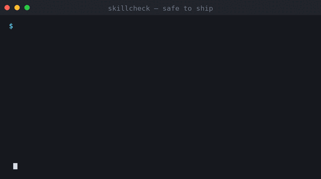
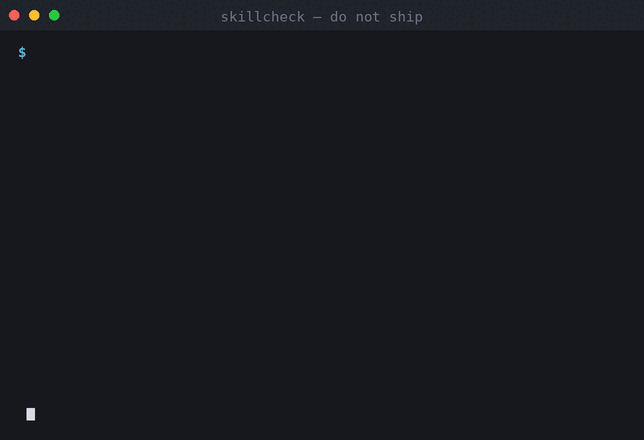
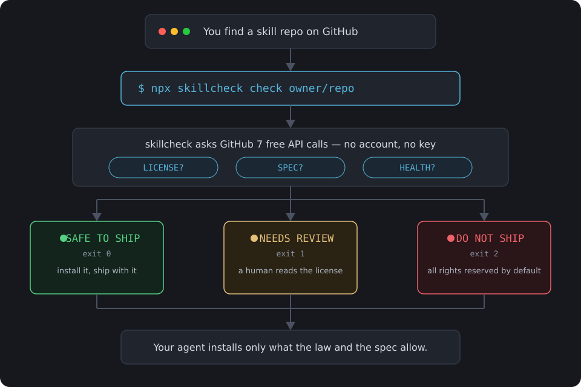

<div align="center">

# skillcheck

**Can you legally ship this agent skill?**

</div>

<table>
<tr>
<td width="50%">

```
$ npx @vortexeddev/skillcheck check obra/superpowers
```



✔ **SAFE TO SHIP** — MIT, spec-valid, maintained.

</td>
<td width="50%">

```
$ npx @vortexeddev/skillcheck check anthropics/skills
```



✖ **DO NOT SHIP** — 175,921 ★ and **no LICENSE file**.

</td>
</tr>
</table>

That second one is real. `anthropics/skills` is the official Agent Skills repo.
With no `LICENSE` file, copyright law defaults to **all rights reserved** — you may not copy,
modify, redistribute or sell anything in it, even though it is public on GitHub.

It is not alone. This tool checks before you find out.

```bash
npx @vortexeddev/skillcheck check owner/repo
```

<div align="center">

[](https://www.npmjs.com/package/@vortexeddev/skillcheck)
[](LICENSE)
[](https://github.com/Vortexeddev/skillcheck/actions/workflows/ci.yml)
[](#why-zero-dependencies)
[](#install)

</div>

---

## The problem

There are **22,678 repositories** tagged [`agent-skills`](https://github.com/topics/agent-skills)
and **8,214** tagged [`claude-skills`](https://github.com/topics/claude-skills). Your coding agent
will execute what those files say. Almost nobody has checked the terms.

`skillcheck` answers three questions in one command:

| Question | What it reads |
|---|---|
| **Can I use this commercially?** | The SPDX expression, resolved properly (`AND`/`OR`/`WITH`) |
| **Will it even load?** | `SKILL.md` validated against the [Agent Skills spec](https://agentskills.io/specification) |
| **Is it still alive?** | Stars, last push, archived state |

### What we measured

Registry snapshot 2026-09-12, top 166 repos by stars across both topics
(reproduce it yourself: `npm run registry:build -- --fast`):

| | |
|---|---|
| ✔ Permissive, safe to ship | **135** (81.3%) |
| ⚠ License file exists but unclassified | **17** (10.2%) |
| ✖ No license at all | **10** (6.0%) |

The popular end is mostly fine. **The long tail is not.** A sample of the 100 most recently
*updated* `agent-skills` repos came back only **46% MIT**, with **17% carrying no license** and
21% unclassified. Those are the ones you install at 2am.

---

## How it works



Seven free API calls, no account, no key. The LICENSE question takes two calls, because GitHub
reports `license: null` for **both** "no license" and "a license we could not classify" — and those
are completely different legal situations. `skillcheck` always fetches the root file listing to
tell them apart.

---

## Install

Nothing to install. Requires Node 18+.

```bash
npx @vortexeddev/skillcheck check owner/repo
```

Or globally: `npm i -g @vortexeddev/skillcheck`

## Commands

```bash
npx @vortexeddev/skillcheck check owner/repo        # GitHub repo (shorthand, URL or SSH remote)
npx @vortexeddev/skillcheck check ./my-skill        # local checkout, fully offline
npx @vortexeddev/skillcheck top [query]             # browse safe-to-ship skills, offline
npx @vortexeddev/skillcheck license "MIT OR AGPL-3.0-only"   # explain an expression
npx @vortexeddev/skillcheck badge owner/repo        # README badge for your own skill
```

## Verdicts

| Verdict | Exit code | Meaning |
|---|---|---|
| ✔ **SAFE TO SHIP** | `0` | Permissive license, spec-valid, maintained. Build on it. |
| ⚠ **NEEDS REVIEW** | `1` | Copyleft, unclassified terms, archived, stale, or spec warnings. A human reads the file. |
| ✖ **DO NOT SHIP** | `2` | No license at all, or the `SKILL.md` breaks the spec and will silently never load. |

Exit codes are deliberate, so CI can gate on them.

### License buckets

| Bucket | Examples | Commercial use |
|---|---|---|
| `permissive` | MIT, Apache-2.0, BSD, ISC, CC0, Unlicense | ✔ Yes |
| `copyleft-weak` | LGPL, MPL-2.0, EPL | ⚠ Keep the licensed files isolated |
| `copyleft-strong` | GPL, AGPL | ⚠ Derivatives inherit the license; AGPL reaches network use |
| `source-available` | BUSL, SSPL, CC-BY-NC | ✖ NC bans commercial use outright |
| `unknown` | anything unrecognised | ⚠ Human review |
| `none` | no LICENSE file | ✖ All rights reserved by default |

### How expressions resolve

```bash
$ npx @vortexeddev/skillcheck license "MIT OR AGPL-3.0-only"     # OR  → you may choose; we still show both
$ npx @vortexeddev/skillcheck license "MIT AND WeirdCorp-1.0"    # AND → worst branch wins
```

False alarms cost a minute. A missed AGPL costs a product, so the tool is conservative by design:
unrecognised is `unknown`, never `permissive`.

## CI

```yaml
# .github/workflows/skillcheck.yml
name: skillcheck
on: [push, pull_request]
jobs:
  check:
    runs-on: ubuntu-latest
    steps:
      - uses: actions/checkout@v4
      - uses: actions/setup-node@v4
        with: { node-version: 20 }
      - run: npx --yes @vortexeddev/skillcheck check . --json   # warn on review, fail on missing license
```

## Badge

```bash
npx @vortexeddev/skillcheck badge owner/repo
```

```markdown
[](https://github.com/Vortexeddev/skillcheck#verdicts)
```

## The registry is generated, not curated

Most skill lists are hand-maintained markdown: a thousand entries, zero verification, and the
maintainer's free time as the update schedule.

`skillcheck` flips that. `data/registry.ts` is **built from the GitHub API** by
[`scripts/build-registry.ts`](scripts/build-registry.ts) and refreshed weekly by
[`.github/workflows/registry.yml`](.github/workflows/registry.yml). List repos (`awesome-*`,
curated collections) are filtered out automatically — they are indexes, not things you install.

| Mode | API calls | What it can tell apart |
|---|---|---|
| `--fast` | 3 | Rebuilds from search metadata alone; runs unauthenticated. Conservative verdicts. |
| verified *(CI)* | 1 per repo | "no license" vs "custom license". Needs `GITHUB_TOKEN`. |

## Why zero dependencies

`npx @vortexeddev/skillcheck` should cost you almost nothing to try. No `node_modules`, no lockfile drift, no
transitive supply chain — a slightly load-bearing claim for a tool whose job is deciding whether
you can trust a file an AI agent will execute.

The SPDX parser ([`src/spdx.ts`](src/spdx.ts)) is ~200 lines and handles `AND`, `OR`, parentheses
and `WITH`. The frontmatter parser ([`src/frontmatter.ts`](src/frontmatter.ts)) implements the YAML
subset the spec permits. 78 tests cover them, including the dangerous guesses:

```bash
npm test          # 78/78
npm run typecheck
npm run build     # one 160 KB file, zero runtime deps
```

## Where it fits

| Tool | Does |
|---|---|
| [`vercel-labs/skills`](https://github.com/vercel-labs/skills) | **installs** skills into 80+ agents |
| [`NVIDIA/SkillSpector`](https://github.com/NVIDIA/SkillSpector) | **scans** skills for security issues |
| **skillcheck** | tells you whether you are **allowed** to use the skill at all |

`skillcheck` is the step *before* the installer. It deliberately does not install and does not
security-scan.

## Contributing

Missing a license in the table? A spec rule we do not enforce? Those are the highest-value PRs.

```bash
git clone https://github.com/Vortexeddev/skillcheck
cd skillcheck && npm install && npm test
```

Please add a test with any rule change — the suite is what stops this tool from quietly becoming
wrong. See [CONTRIBUTING.md](CONTRIBUTING.md).

## Not legal advice

A static checker written by developers, not lawyers. For anything you are actually selling, have a
lawyer read the file.

## License

MIT © skillcheck contributors. Use it, fork it, ship it, sell what you build with it.
